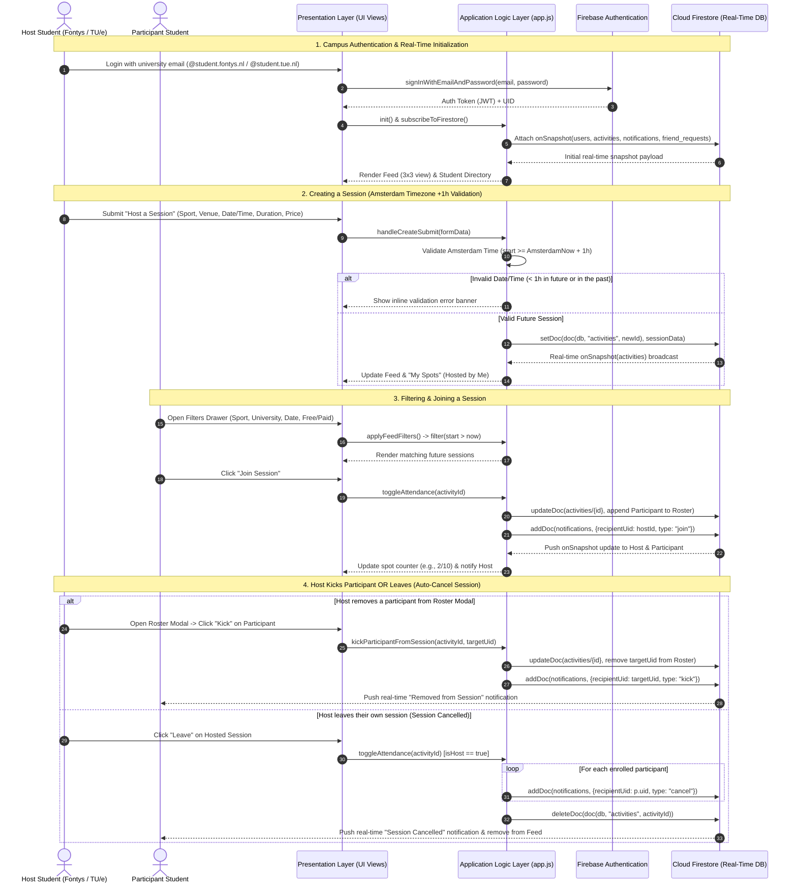
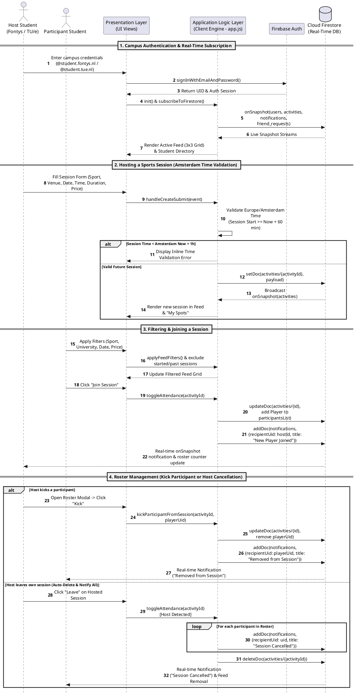

# UniSport Eindhoven — Sequence Diagram

## 1. Visual Diagram (Mermaid — Auto-Rendered on GitHub)

```mermaid
sequenceDiagram
  autonumber
  actor Host as Host Student (Fontys / TU/e)
  actor Player as Participant Student
  participant UI as Presentation Layer (UI Views)
  participant Engine as Application Logic Layer (app.js)
  participant Auth as Firebase Authentication
  participant DB as Cloud Firestore (Real-Time DB)

  Note over Host, DB: 1. Campus Authentication & Real-Time Initialization
  Host->>UI: Login with university email (@student.fontys.nl / @student.tue.nl)
  UI->>Auth: signInWithEmailAndPassword(email, password)
  Auth-->>UI: Auth Token (JWT) + UID
  UI->>Engine: init() & subscribeToFirestore()
  Engine->>DB: Attach onSnapshot(users, activities, notifications, friend_requests)
  DB-->>Engine: Initial real-time snapshot payload
  Engine-->>UI: Render Feed (3x3 view) & Student Directory

  Note over Host, DB: 2. Creating a Session (Amsterdam Timezone +1h Validation)
  Host->>UI: Submit "Host a Session" (Sport, Venue, Date/Time, Duration, Price)
  UI->>Engine: handleCreateSubmit(formData)
  Engine->>Engine: Validate Amsterdam Time (start >= AmsterdamNow + 1h)
  alt Invalid Date/Time (< 1h in future or in the past)
    Engine-->>UI: Show inline validation error banner
  else Valid Future Session
    Engine->>DB: setDoc(doc(db, "activities", newId), sessionData)
    DB-->>Engine: Real-time onSnapshot(activities) broadcast
    Engine-->>UI: Update Feed & "My Spots" (Hosted by Me)
  end

  Note over Player, DB: 3. Filtering & Joining a Session
  Player->>UI: Open Filters Drawer (Sport, University, Date, Free/Paid)
  UI->>Engine: applyFeedFilters() -> filter(start > now)
  Engine-->>UI: Render matching future sessions
  Player->>UI: Click "Join Session"
  UI->>Engine: toggleAttendance(activityId)
  Engine->>DB: updateDoc(activities/{id}, append Participant to Roster)
  Engine->>DB: addDoc(notifications, {recipientUid: hostId, type: "join"})
  DB-->>Engine: Push onSnapshot update to Host & Participant
  Engine-->>UI: Update spot counter (e.g., 2/10) & notify Host

  Note over Host, DB: 4. Host Kicks Participant OR Leaves (Auto-Cancel Session)
  alt Host removes a participant from Roster Modal
    Host->>UI: Open Roster Modal -> Click "Kick" on Participant
    UI->>Engine: kickParticipantFromSession(activityId, targetUid)
    Engine->>DB: updateDoc(activities/{id}, remove targetUid from Roster)
    Engine->>DB: addDoc(notifications, {recipientUid: targetUid, type: "kick"})
    DB-->>Player: Push real-time "Removed from Session" notification
  else Host leaves their own session (Session Cancelled)
    Host->>UI: Click "Leave" on Hosted Session
    UI->>Engine: toggleAttendance(activityId) [isHost == true]
    loop For each enrolled participant
      Engine->>DB: addDoc(notifications, {recipientUid: p.uid, type: "cancel"})
    end
    Engine->>DB: deleteDoc(doc(db, "activities", activityId))
    DB-->>Player: Push real-time "Session Cancelled" notification & remove from Feed
  end
```

---

## 2. PlantUML Source Code (`.puml`)

```plantuml
@startuml UniSport_Sequence_Diagram
autonumber
skinparam style strictuml
skinparam SequenceMessageAlign center
skinparam MaxMessageSize 180

actor "Host Student\n(Fontys / TU/e)" as Host
actor "Participant Student" as Player
participant "Presentation Layer\n(UI Views)" as UI
participant "Application Logic Layer\n(Client Engine - app.js)" as Engine
participant "Firebase Auth" as Auth
database "Cloud Firestore\n(Real-Time DB)" as DB

== 1. Campus Authentication & Real-Time Subscription ==
Host -> UI : Enter campus credentials (@student.fontys.nl / @student.tue.nl)
UI -> Auth : signInWithEmailAndPassword()
Auth --> UI : Return UID & Auth Session
UI -> Engine : init() & subscribeToFirestore()
Engine -> DB : onSnapshot(users, activities, notifications, friend_requests)
DB --> Engine : Live Snapshot Streams
Engine --> UI : Render Active Feed (3x3 Grid) & Student Directory

== 2. Hosting a Sports Session (Amsterdam Time Validation) ==
Host -> UI : Fill Session Form (Sport, Venue, Date, Time, Duration, Price)
UI -> Engine : handleCreateSubmit(event)
Engine -> Engine : Validate Europe/Amsterdam Time\n(Session Start >= Now + 60 min)

alt Session Time < Amsterdam Now + 1h
  Engine --> UI : Display Inline Time Validation Error
else Valid Future Session
  Engine -> DB : setDoc(activities/{activityId}, payload)
  DB --> Engine : Broadcast onSnapshot(activities)
  Engine --> UI : Render new session in Feed & "My Spots"
end

== 3. Filtering & Joining a Session ==
Player -> UI : Apply Filters (Sport, University, Date, Price)
UI -> Engine : applyFeedFilters() & exclude started/past sessions
Engine --> UI : Update Filtered Feed Grid
Player -> UI : Click "Join Session"
UI -> Engine : toggleAttendance(activityId)
Engine -> DB : updateDoc(activities/{id}, add Player to participantsList)
Engine -> DB : addDoc(notifications, {recipientUid: hostId, title: "New Player Joined"})
DB --> Host : Real-time onSnapshot notification & roster counter update

== 4. Roster Management (Kick Participant or Host Cancellation) ==
alt Host kicks a participant
  Host -> UI : Open Roster Modal -> Click "Kick"
  UI -> Engine : kickParticipantFromSession(activityId, playerUid)
  Engine -> DB : updateDoc(activities/{id}, remove playerUid)
  Engine -> DB : addDoc(notifications, {recipientUid: playerUid, title: "Removed from Session"})
  DB --> Player : Real-time Notification ("Removed from Session")
else Host leaves own session (Auto-Delete & Notify All)
  Host -> UI : Click "Leave" on Hosted Session
  UI -> Engine : toggleAttendance(activityId) [Host Detected]
  loop For each participant in Roster
    Engine -> DB : addDoc(notifications, {recipientUid: uid, title: "Session Cancelled"})
  end
  Engine -> DB : deleteDoc(activities/{activityId})
  DB --> Player : Real-time Notification ("Session Cancelled") & Feed Removal
end

@enduml
```
